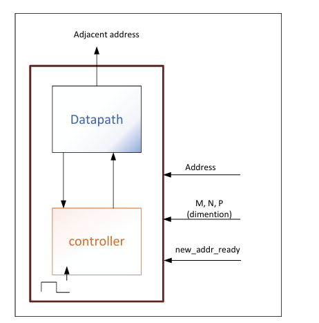
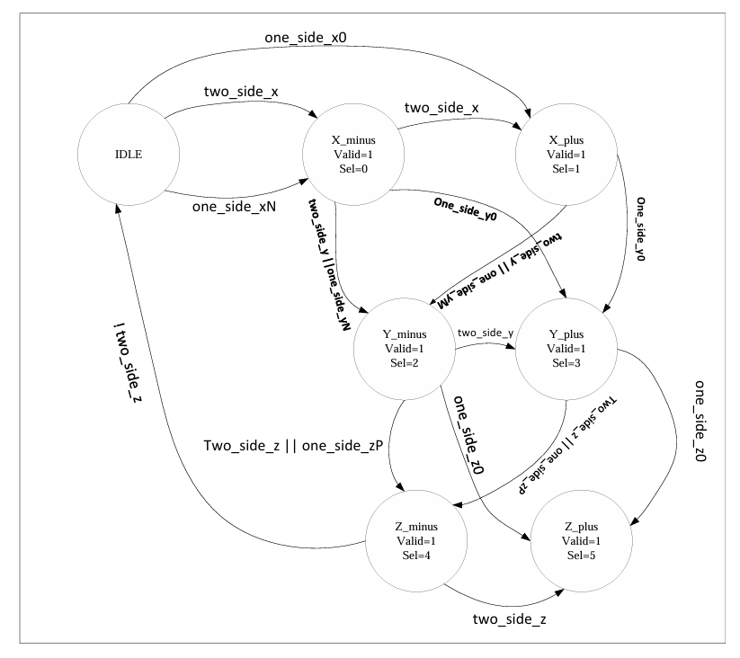
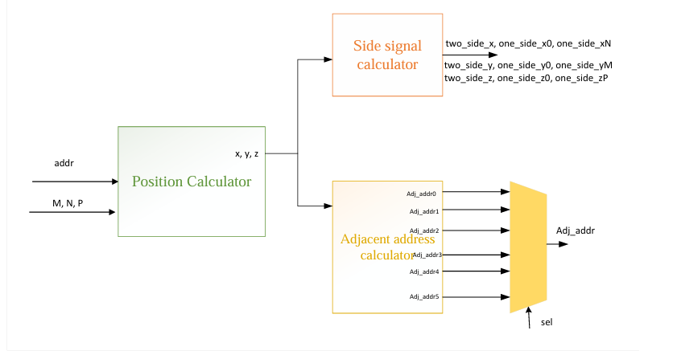

# Hardware Prefetcher for 3D Spatial Algorithms

## Overview
This project implements a SystemVerilog hardware prefetcher designed to reduce memory latency in 3D spatial processing. The prefetcher anticipates the data needs of a processor by predicting and fetching adjacent addresses in a 3D space from slow memory to fast cache memory, significantly improving access efficiency for spatial data structures.

## Architecture
The implementation relies on two primary concurrent modules:
* **Datapath (`datapath.sv`):** Responsible for executing precise adjacent address calculations across variable grid dimensions (M × N × P). It takes the current `x, y, z` coordinates and calculates the surrounding addresses dynamically.
* **Controller (`controller.sv`):** A 6-state Finite State Machine (FSM) that manages transition states (IDLE, X_minus, X_plus, Y_minus, Y_plus, Z_minus, Z_plus) based on boundary conditions (e.g., checking if an address is on the edge of the grid to avoid fetching invalid data).

### Top Module

### Controller FSM

### Concurrent Datapath

## File Structure
* `topModule.sv`: The top-level entity tying the datapath and controller together.
* `datapath.sv`: Arithmetic and positional logic for 3D grid calculations.
* `controller.sv`: The FSM managing the sequence of prefetch operations.
* `testbench.sv`: An extensive verification harness to validate sequential operational integrity and accurate address generation.
* `prefetcher.mpf`: ModelSim/Questa project file.

## Verification
The design was rigorously verified via RTL simulation. The `testbench.sv` tests various edge cases (such as coordinates located on grid boundaries) to ensure the side-signal calculator correctly asserts flags (e.g., `two_side_x`, `one_side_yM`) and the FSM outputs the correct valid sequence of adjacent memory addresses.

## Full Technical Report
For a deep dive into the algorithmic pseudocode, state machine transitions, and waveform analysis, please read the [Full Project Report](report_3d_prefetcher.pdf).
